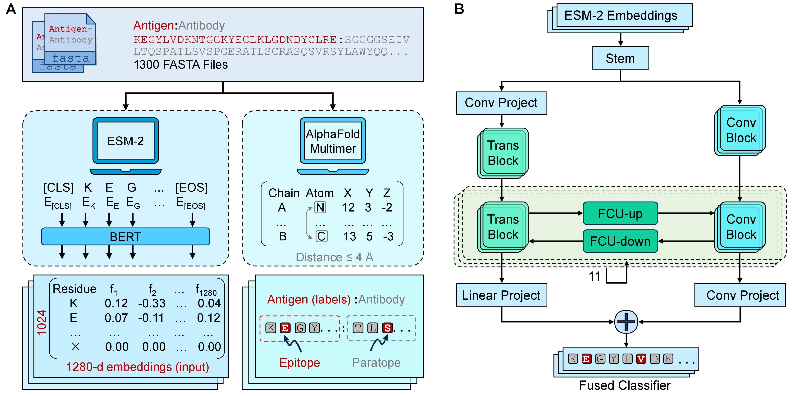

<h1 align="center">
BConformeR: A Conformer Based on Mutual Sampling for Unified Prediction of Continuous and Discontinuous Antibody Binding Sites
</h1>

<p align="center"> 
  <a href="https://github.com/Jerry-alt19/BConformeR/blob/main/LICENSE"> 
     
  </a> 
  <a href="https://github.com/pytorch/pytorch"> 
     
  </a> 
  <a href="https://github.com/Jerry-alt19/BConformeR"> 
     
  </a> 
</p>

Accurate prediction of antibody-binding sites (epitopes) on antigens is crucial for vaccine design, immunodiagnostics, therapeutic antibody development, antibody engineering, research into autoimmune and allergic diseases, and for advancing our understanding of immune responses. Despite in silico methods that have been proposed to predict both linear (continuous) and conformational (discontinuous) epitopes, they consistently underperform in predicting conformational epitopes. In this work, we propose a conformer-based model trained on antigen sequences derived from 1,080 antigen-antibody complexes, leveraging convolutional neural networks (CNNs) to extract local features and Transformers to capture long-range dependencies within antigen sequences.





## Installation

### 1. Clone this repository:

```bash
git clone https://github.com/Jerry-alt19/BConformeR.git
cd BConformeR
```

### 2. Create and activate a conda environment:
```bash
conda create -n bconformer python=3.9
conda activate bconformer
```

### 3. Install dependencies:
```bash
pip install -r requirements.txt
```

### 4. Run prediction:
```bash
python predict.py --fasta example.fasta --out_dir predictions
```

#### Arguments

```bash
--fasta       (str, required)   Path to the input FASTA file containing antigen sequences.
--out_dir     (str, optional)   Directory where CSV prediction files will be saved. Default: "predictions"
--threshold   (float, optional) Probability threshold to determine if a residue is an epitope. Default: 0.3
--model_path  (str, optional)   Path to the trained Conformer model. Default: "src/model/bconformer_1.pth"
```

#### Output

For each antigen sequence in the FASTA file, a CSV file is generated in the specified `--out_dir` directory. Each CSV file is named `<sequence_id>.csv` and contains the following columns:

| Column | Description |
|--------|-------------|
| Index  | Residue position in the sequence (starting from 1) |
| Residue | Amino acid at the given position |
| Score  | Predicted epitope probability (from 0 to 1) |
| Predicted Label | 1 if `Score >= threshold`, otherwise 0 |


## Systems

To run BConformeR from scratch, the following hardware and GPU configurations are recommended:

### 1. Hardware
- GPU: NVIDIA A100-SXM4 40GB or equivalent
- Memory: ≥ 40GB GPU memory
- Disk space: ≥ 50GB free
- CUDA-enabled GPU for GPU acceleration

### 2. GPU Setup

| GPU | Name                     | Memory |
|-----|--------------------------|--------|
| 0   | NVIDIA A100-SXK4-40GB    | 40GB   |
| 1   | NVIDIA A100-SXM4-40GB    | 40GB   |
| 2   | NVIDIA A100-SXM4-40GB    | 40GB   |
| 3   | NVIDIA A100-SXM4-40GB    | 40GB   |


## Dataset
Data was collected from [**AbEpiTope-1.0**](https://services.healthtech.dtu.dk/services/AbEpiTope-1.0/).


## Citation

If you use or refer to this work, please cite our paper:


The Conformer architecture is cited as:
```text
@inproceedings{peng2021conformer,
  title={Conformer: Local features coupling global representations for visual recognition},
  author={Peng, Zhiliang and Huang, Wei and Gu, Shanzhi and Xie, Lingxi and Wang, Yaowei and Jiao, Jianbin and Ye, Qixiang},
  booktitle={Proceedings of the IEEE/CVF international conference on computer vision},
  pages={367--376},
  year={2021}
}
```

## License

This project is licensed under the MIT License - see the [LICENSE](LICENSE) file for details.


